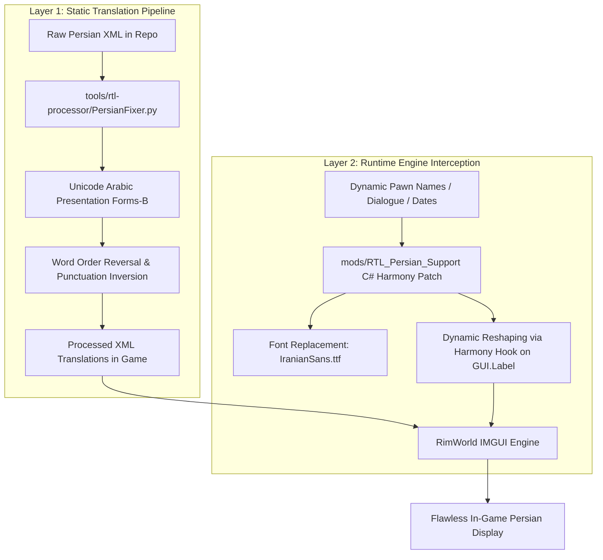

# Technical Challenges in RimWorld RTL Localization

This document details the architectural and rendering challenges involved in providing Right-to-Left (RTL) Arabic script language support (specifically Persian/Farsi and Arabic) in RimWorld, drawing upon findings from both the official Arabic localization effort ([Ludeon/RimWorld-ar#11](https://github.com/Ludeon/RimWorld-ar/issues/11), [Ludeon/RimWorld-ar#13](https://github.com/Ludeon/RimWorld-ar/issues/13)) and the Persian localization pipeline.

---

## 1. Engine Core Constraint: Unity IMGUI vs Text Meshes

The foundational challenge of rendering Persian and Arabic in RimWorld stems directly from the engine's UI architecture:

> *"RimWorld uses IMGUI. There are no text meshes."*  
> — **Tynan Sylvester**, Lead Developer, Ludeon Studios ([Ludeon/RimWorld-ar#11](https://github.com/Ludeon/RimWorld-ar/issues/11))

### What Does This Mean?
Modern games and engines commonly use text mesh frameworks (such as Unity's TextMeshPro or modern Canvas UI). These frameworks:
1. Integrate with advanced text shaping engines like **HarfBuzz** or **FreeType**.
2. Dynamically evaluate **OpenType Layout (OTL)** tables (`GSUB` for glyph substitution and `GPOS` for glyph positioning).
3. Implement the standard **Unicode Bidirectional Algorithm (UBA / BiDi)** out of the box.

In contrast, RimWorld's UI is built on **Unity's legacy Immediate Mode GUI (IMGUI)**, utilizing `UnityEngine.GUI.Label`, `GUIStyle`, and `UnityEngine.TextGenerator`. IMGUI renders strings as simple sequences of font glyphs assuming standard Latin Left-to-Right (LTR) characteristics.

---

## 2. Core Rendering Failures in Vanilla IMGUI

When untreated Persian or Arabic text is passed to RimWorld's IMGUI, two critical failures occur:

```
Normal Persian:       فارسی          (Correct cursive ligatures, RTL order)
Vanilla IMGUI Output: ی س ر ا ف      (Disconnected isolated glyphs, LTR order)
```

### 2.1. Disconnected Letters (Lack of Cursive Shaping)
In the Arabic and Persian writing systems, characters change their visual shape depending on their position within a word:
- **Isolated** (تنها)
- **Initial** (آغازین)
- **Medial** (میانی)
- **Final** (پایانی)

Because IMGUI has no shaping engine, it draws each character using its default isolated Unicode code point (e.g., standard `0x0641` for `ف`). As a result, words are rendered as disjointed, detached letters (e.g., `ا ب ح ر م` instead of `مرحبا`, or `پ ا ر س ی` instead of `پارسی`).

### 2.2. Inverted Word and Sentence Direction
IMGUI lays out glyphs strictly from left to right. Characters entered in logical RTL order are drawn backwards, inverting names, phrases, and entire paragraphs.

### 2.3. The Multiline Line-Wrapping Bug
As documented in [Ludeon/RimWorld-ar#13](https://github.com/Ludeon/RimWorld-ar/issues/13), even if text is reversed prior to rendering, IMGUI's automatic word-wrapping algorithm calculates line breaks assuming text flows from left to right. 

When a long paragraph exceeds the bounding box:
1. IMGUI breaks the line at the *rightmost* characters (which it assumes is the end of the line, but in RTL is actually the beginning).
2. The wrapped lines appear stacked in reverse vertical or horizontal sequence, causing paragraphs and story letters to become completely illegible.

### 2.4. Dynamic Token Scrambling
RimWorld generates vast amounts of procedural narrative using format tokens (e.g., `{0} has attacked {1}!`, `{PAWN_nameDef} is feeling sad`). When numbers, English names, or foreign terms are dynamically injected into a pre-reversed Persian sentence, standard BiDi boundary transitions fail, placing numbers and Latin names on the wrong side of the surrounding phrase.

---

## 3. The Dual-Layer Architectural Solution

To achieve clean, readable Persian text in RimWorld while preserving compatibility across vanilla and modded setups, this project implements a **two-layered strategy**:



### Layer 1: Static Preprocessing (`tools/rtl-processor/`)
For static UI labels, item descriptions, and research trees that do not change at runtime:
1. **Contextual Glyph Mapping**: `PersianFixer.py` evaluates adjacent characters and replaces standard Persian characters with their corresponding **Unicode Arabic Presentation Forms-A and Forms-B** code points (`0xFE80`–`0xFEFC` and `0xFB50`–`0xFDFF`).
2. **Direction Reversal**: Words and sentences are pre-reversed so that IMGUI's left-to-right drawing order displays them in natural Persian right-to-left order.
3. **Vanilla Compatibility**: This allows players to use the Persian translation directly in unmodded RimWorld without requiring any third-party C# assemblies or loader mods.

### Layer 2: Runtime Harmony Mod (`mods/RTL_Persian_Support/`)
To resolve dynamic strings and multiline wrapping that cannot be handled statically:
1. **Harmony Method Interception**: Uses Harmony to hook into `UnityEngine.GUI.Label`, `Verse.Text.CalcSize`, and RimWorld dialogue rendering routines.
2. **Font Injection**: Replaces default fonts with high-legibility Persian typefaces (`IranianSans.ttf`).
3. **Runtime BiDi & Shaping**: Dynamically applies Arabic/Persian shaping to procedural pawn names, combat logs, and quest descriptions before IMGUI measures and draws them.

---

## 4. Key References & Community Milestones

- **[Ludeon/RimWorld-ar Issue #11](https://github.com/Ludeon/RimWorld-ar/issues/11)**: Initial discussion with Tynan Sylvester regarding Arabic support, Unity IMGUI limitations, and absence of text meshes.
- **[Ludeon/RimWorld-ar Issue #13](https://github.com/Ludeon/RimWorld-ar/issues/13)**: In-depth technical breakdown of multiline text wrapping and pre-processed text reversal bugs by Mohamed Moustafa (`@mtimoustafa`).
- **Unicode Standard Annex #9**: [The Bidirectional Algorithm (UAX #9)](https://unicode.org/reports/tr9/) specification for handling bidirectional script layout.
- **Unicode Presentation Forms**:
  - [Arabic Presentation Forms-A (U+FB50–U+FDFF)](https://en.wikipedia.org/wiki/Arabic_Presentation_Forms-A) (Contains Persian extensions: `پ`, `چ`, `ژ`, `گ`).
  - [Arabic Presentation Forms-B (U+FE70–U+FEFF)](https://en.wikipedia.org/wiki/Arabic_Presentation_Forms-B) (Contains standard Arabic contextual glyph forms).
