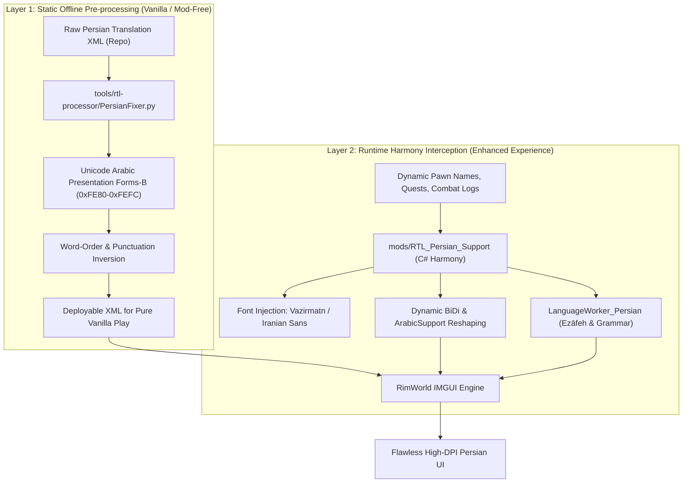

```
PEP: 2026
Title: RimWorld Farsi Localization Architecture & Strategic Implementation Plan ("King of Kings")
Author: RimWorld Farsi Core Team <danial.pm@gmail.com>
Status: Active
Type: Process / Standards Track
Created: 28-Sep-2026
RimWorld-Version: 1.5+ / 1.6 (Odyssey)
Python-Version: >= 3.11
Requires: lxml >= 5.0.0, Harmony >= 2.2, UnityEngine >= 2019.4
Replaces: None
```

# PEP 2026: RimWorld Farsi Localization Architecture & Strategic Implementation Plan

---

## 📋 Table of Contents
1. [Abstract](#abstract)
2. [Motivation & Ecosystem Inspiration](#motivation--ecosystem-inspiration)
3. [Baseline Status & Translation Inventory](#baseline-status--translation-inventory)
4. [Architectural Specification](#architectural-specification)
5. [Phased Implementation Roadmap](#phased-implementation-roadmap)
   - [Phase 1: Linguistic Engine & WordInfo Automation](#phase-1-linguistic-engine--wordinfo-automation)
   - [Phase 2: Translation Linter & CI/CD Quality Gates](#phase-2-translation-linter--cicd-quality-gates)
   - [Phase 3: Runtime Mod Optimization & Steam Workshop Packaging](#phase-3-runtime-mod-optimization--steam-workshop-packaging)
   - [Phase 4: AI Contributor Infrastructure & Automated Upstream Sync](#phase-4-ai-contributor-infrastructure--automated-upstream-sync)
6. [Interactive Task Tracking Matrix](#interactive-task-tracking-matrix)
7. [Backwards Compatibility](#backwards-compatibility)
8. [Security & Performance Implications](#security--performance-implications)
9. [References & Prior Art](#references--prior-art)

---

## Abstract

**PEP 2026** defines the strategic architecture, linguistic standards, and engineering roadmap to establish the **RimWorld Farsi (Persian)** translation as the gold standard ("King of Kings") within Ludeon Studios' localization ecosystem.

While RimWorld-Farsi already achieves 100% translation coverage across Core and all five expansions (Royalty, Ideology, Biotech, Anomaly, Odyssey) encompassing 1,537 valid XML files, Right-to-Left (RTL) Arabic script languages face severe challenges under Unity's legacy Immediate Mode GUI (IMGUI). This PEP establishes:
1. **Dynamic Linguistic Handling**: Automated `WordInfo` generation for Persian Ezāfeh (اضافه), numeral classifiers, and a custom C# `LanguageWorker_Persian`.
2. **Industrial-Grade QA Linters**: Deterministic syntax validation for placeholders (`{0}`, `{PAWN_gender}`), report string punctuation, and strict Persian typography (ZWNJ / نیم‌فاصله, Persian `ک`/`ی`).
3. **Frictionless 1-Click Distribution**: Steam Workshop automated CI/CD pipeline and multi-platform native installers.
4. **Next-Generation AI Tooling**: Machine-readable contributor guidelines (`AGENTS.md`) and deterministic placeholder AST parsers inspired by the vanguard of RimWorld localization engineering.

---

## Motivation & Ecosystem Inspiration

A survey of all 56 repositories across the official [Ludeon organization](https://github.com/Ludeon) reveals distinct leadership patterns that PEP 2026 synthesizes and surpasses:

- **Russian ([Ludeon/RimWorld-ru](https://github.com/Ludeon/RimWorld-ru))**: The community benchmark with 200+ stars and 116 forks. Pioneered multi-layered CI/CD validation (`check_pawn_gender.py`, `check_report_string_dot.py`, `worldinfo_case.py`), decompiled C# integration (`.Decompiled/Verse/GrammarResolverSimple.cs`), and AI agent pairing specs (PR #1742).
- **German ([Ludeon/RimWorld-de](https://github.com/Ludeon/RimWorld-de))**: The grammatical benchmark. Automates `WordInfo` synchronization across thousands of defs, dynamically isolating new words for translators into `new_words.txt`.
- **Chinese ([Ludeon/RimWorld-ChineseSimplified](https://github.com/Ludeon/RimWorld-ChineseSimplified))**: Scaled community terminology harmonization ("统一文本") and non-Latin typography fixes for cross-platform Linux / Steam Deck rendering.
- **Arabic ([Ludeon/RimWorld-ar](https://github.com/Ludeon/RimWorld-ar))**: Highlighted the severe Unity IMGUI text-mesh limitations ([Ludeon #11](https://github.com/Ludeon/RimWorld-ar/issues/11), [#13](https://github.com/Ludeon/RimWorld-ar/issues/13)) but remained stalled on legacy 1.0 folder architectures without a completed dual-layer runtime engine.

**RimWorld-Farsi** is uniquely positioned to integrate the grammatical rigor of German, the CI/CD and AI sophistication of Russian, and a state-of-the-art RTL rendering engine to establish the highest standard in the community.

---

## Baseline Status & Translation Inventory

### Module Coverage Overview
All 1,537 XML translation files across all six modules are well-formed and 100% translated (0 `TODO` tags remaining):

| Module | Status | Total Files | Untranslated Tags (`TODO`) | XML Validity |
| :--- | :---: | :---: | :---: | :---: |
| **Core** | Complete | 531 | 0 | 100% Valid |
| **Royalty DLC** | Complete | 146 | 0 | 100% Valid |
| **Ideology DLC** | Complete | 287 | 0 | 100% Valid |
| **Biotech DLC** | Complete | 204 | 0 | 100% Valid |
| **Anomaly DLC** | Complete | 177 | 0 | 100% Valid |
| **Odyssey (1.6)** | Complete | 192 | 0 | 100% Valid |
| **Total** | **100%** | **1,537 Files** | **0** | **100% Valid** |

### Verified Translation Categories
- ✅ **Keyed Translations (100%)**: `TerrainTags.xml`, `Menu_Options.xml`, `Dialog_Trees.xml`, `FloatMenu.xml`, `Letters.xml`, `Messages.xml`, `MainTabs.xml`, `Menus_Main.xml`, `GameplayCommands.xml`, `ScenParts.xml`, `Dialog_StatsReports.xml`.
- ✅ **Tales & Narrative Events**: Incident Tales (446 entries), Health Tales (369), Job Tales (298), Single Pawn Tales (286), Double Pawn Tales (230), Caravan Tales (98).
- ✅ **Genes & Biology (Biotech)**: Gene Spectrum (303 entries), Endogenes (245), Cosmetic Genes (163), Misc Genes (102).
- ✅ **Research Projects**: Electricity (201 entries), Basic Research (154), Anomaly Research, Misc Projects (145).
- ✅ **Thoughts, Needs & Conditions**: Memory Thoughts (153 entries), Special Situations (143), Need Thoughts (118), Global Hediffs (141).
- ✅ **Quests & World Sites**: Space Sites (186 entries), Refugee Hospitality (156), Ancient Structures (117).
- ✅ **Biomes (Odyssey)**: Glacial Plain, Glowforest, Grasslands, Lava Field, Scarlands, Space.
- ✅ **Backstories & Factions**: Imperial Common/Fighter/Royal, Solid, Offworld; Player & NPC Factions (Ancients, Insects, Mechanoids, Outlanders, Pirates, Tribes, Empire).

---

## Architectural Specification

RimWorld-Farsi operates on a **Dual-Layer Architecture**:



---

## Phased Implementation Roadmap

### Phase 1: Linguistic Engine & WordInfo Automation
*Objective: Implement native RimWorld grammatical structures for Persian noun phrases, plurals, and Ezāfeh connectors.*

- **1.1. Automated WordInfo Generation Tool (`tools/translation-tools/update_wordinfo.py`)**:
  - Python tool scanning all `DefInjected` tags (`.label`, `.labelMale`, `.labelFemale`, `.labelPlural`, `.chargeNoun`).
  - Auto-generate structured lookup files under `<DLC>/WordInfo/`:
    - `plural.txt`: Singular-to-plural mappings (differentiating human `ـان` from generic `ـها`).
    - `ezafeh.txt`: Lookup table handling noun-adjective connectors (`{lookup: {0_label}; ezafeh; 1}`).
    - `new_words.txt`: Unclassified terms surfaced during game updates for translator review.
- **1.2. Custom C# `LanguageWorker_Persian` Implementation**:
  - Implement `LanguageWorker_Persian` in `mods/RTL_Persian_Support/Source/`.
  - Override `Pluralize(string str, Gender gender, int count)` to enforce Persian numeral syntax (numerals take singular nouns: "۵ استعمارگر" instead of "۵ استعمارگران").
  - Override `PostProcessedKeyed` for BiDi whitespace cleanup and inline ZWNJ protection.
  - Update `LanguageInfo.xml` in `Core/` and DLCs to bind to `RTL_Persian.LanguageWorker_Persian`.

---

### Phase 2: Translation Linter & CI/CD Quality Gates
*Objective: Build an impenetrable QA pipeline catching semantic, grammatical, and typographical defects on PRs.*

- **2.1. Placeholder & Token Integrity Validator (`tools/qa/check_placeholders.py`)**:
  - Verify every translation preserves exact positional variables (`{0}`, `{1}`, `{2}`) from English comments (`<!-- EN: ... -->`).
  - Verify named variables (`{PAWN_nameDef}`, `{PAWN_pronoun}`, `{FACTION_name}`).
  - Validate conditional gender syntax (`{PAWN_gender ? male : female}`) and reject identical branches (`{PAWN_gender ? رفت : رفت}`).
- **2.2. Persian Typography & Character Validator (`tools/qa/check_persian_typography.py`)**:
  - Detect and reject Arabic codepoint contamination (`ك` U+0643 -> `ک` U+06A9, `ي` U+064A -> `ی` U+06CC).
  - Enforce Persian punctuation (`؟` U+061F, `،` U+060C, `؛` U+061B).
  - Verify Zero-Width Non-Joiner (ZWNJ / U+200C) rules for verbal prefixes (`می‌`, `نمی‌`) and compound plurals (`ها`).
- **2.3. RimWorld ReportString Period Checker (`tools/qa/check_report_strings.py`)**:
  - Check that all `reportString` tags do not end with a period (`.` or `۔`), preventing double-punctuation in job tooltips and pawn inspect panels.
- **2.4. CI/CD Integration**:
  - Embed the QA suite into `.github/workflows/reusable-testing.yml` with automated PR annotations and failure reports.

---

### Phase 3: Runtime Mod Optimization & Steam Workshop Packaging
*Objective: Provide a seamless 1-click install experience for gamers across Windows, Linux, macOS, and Steam Deck.*

- **3.1. Modern Typography Asset Integration (Vazirmatn & Iranian Sans)**:
  - Embed **Vazirmatn** (screen-optimized modern UI typeface) alongside **Iranian Sans** in the Unity AssetBundle.
  - Expose font sizing options in the mod settings to avoid UI truncation on 720p/800p displays (Steam Deck).
- **3.2. Automated Steam Workshop Release Pipeline**:
  - Configure GitHub Actions with SteamCMD (`steam-deploy`) to compile the C# assembly and push tagged releases directly to Steam Workshop.
  - Include metadata and package descriptors for RimSort and RimPy mod managers.
- **3.3. Smart Multi-Platform Shell Installers**:
  - Upgrade `install.sh` and `install.bat` with auto-discovery for Steam Deck, Flatpak Steam, and custom Proton drives.
  - Automatically remove cached `.tar` files in `Languages/` to force RimWorld to reload fresh XML assets.

---

### Phase 4: AI Contributor Infrastructure & Automated Upstream Sync
*Objective: Equip human contributors and AI pair-programming agents with state-of-the-art tools.*

- **4.1. Deterministic AST Placeholder Parser (`tools/parse_placeholder.py`)**:
  - Standalone CLI port of RimWorld's `TryResolveInner` grammar algorithm.
  - Provides instant inspection of Symbols, Subsymbols, and Function macros (`lookup`, `replace`) for any `{...}` token.
- **4.2. Contributor Guidelines for AI Agents (`AGENTS.md`)**:
  - Repository-wide guide instructing LLM coding assistants on:
    - Inviolability of `{...}` placeholders.
    - Official Persian terminology glossary.
    - ZWNJ and punctuation standards.
- **4.3. Upstream Game Update Diff Engine (`tools/translation-tools/check_upstream_diff.py`)**:
  - Auto-diff local translations against fresh English RimWorld game files.
  - Generate formatted translation stubs with `<!-- EN: ... -->` comments for new DLCs and game patches.

---

## Interactive Task Tracking Matrix

| ID | Phase | Priority | Description | Target Path | Status |
| :---: | :---: | :---: | :--- | :--- | :---: |
| **T101** | Phase 1 | P1 | Automated `WordInfo` extraction script | `tools/translation-tools/update_wordinfo.py` | [x] Completed |
| **T102** | Phase 1 | P1 | Generate initial `plural.txt` and `ezafeh.txt` tables | `Core/WordInfo/` | [x] Completed |
| **T103** | Phase 1 | P1 | Custom C# `LanguageWorker_Persian` | `mods/RTL_Persian_Support/Source/LanguageWorker_Persian.cs` | [x] Completed |
| **T104** | Phase 1 | P2 | Update `LanguageInfo.xml` references across DLCs | `Core/LanguageInfo.xml` | [x] Completed |
| **T201** | Phase 2 | P0 | Placeholder & token integrity checker | `tools/qa/check_placeholders.py` | [ ] Pending |
| **T202** | Phase 2 | P0 | Persian typography & ZWNJ validator | `tools/qa/check_persian_typography.py` | [ ] Pending |
| **T203** | Phase 2 | P1 | ReportString dot validator | `tools/qa/check_report_strings.py` | [ ] Pending |
| **T204** | Phase 2 | P1 | Wire QA linter suite into GitHub Actions workflow | `.github/workflows/reusable-testing.yml` | [ ] Pending |
| **T301** | Phase 3 | P1 | Vazirmatn font asset integration & sizing options | `mods/RTL_Persian_Support/` | [ ] Pending |
| **T302** | Phase 3 | P2 | Steam Workshop automated publishing workflow | `.github/workflows/steam-workshop.yml` | [ ] Pending |
| **T303** | Phase 3 | P1 | Enhanced multi-platform installers (Steam Deck / Flatpak) | `install.sh`, `install.bat` | [ ] Pending |
| **T401** | Phase 4 | P1 | Deterministic AST placeholder CLI parser | `tools/parse_placeholder.py` | [ ] Pending |
| **T402** | Phase 4 | P1 | AI Contributor Rules & System Specification | `AGENTS.md` | [ ] Pending |
| **T403** | Phase 4 | P2 | Automated upstream DLC diff & stub generation tool | `tools/translation-tools/check_upstream_diff.py` | [ ] Pending |

---

## Backwards Compatibility

1. **100% Save Compatibility**: Adding or removing this translation pack modifies no game assemblies or saved world states.
2. **Vanilla Playability**: The Layer 1 static preprocessor guarantees that players who do not wish to use Harmony mods can still play in Persian with shaped RTL text.
3. **DLC Independence**: Every DLC directory (`Royalty`, `Ideology`, `Biotech`, `Anomaly`, `Odyssey`) is self-contained and functions whether the player owns all or none of the expansions.

---

## Security & Performance Implications

- **XML Security**: All python tooling utilizes `defusedxml` or hardened `lxml` parsers with `resolve_entities=False` to prevent XML Entity Expansion (Billion Laughs) attacks.
- **Runtime Performance**: In-game string shaping in `RTL_Persian_Support` utilizes an LRU string cache (`MaxCacheSize = 8000`) and ZWSP (`\u200B`) idempotency markers to ensure zero frame-rate impact during active colony gameplay.

---

## References & Prior Art

1. **[Ludeon/RimWorld-ru](https://github.com/Ludeon/RimWorld-ru)**: CI/CD workflows and PR #1742 (AI Agent tooling).
2. **[Ludeon/RimWorld-de](https://github.com/Ludeon/RimWorld-de)**: `WordInfo` generation scripts (`update-wordinfo-*.ps1`).
3. **[Ludeon/RimWorld-ar](https://github.com/Ludeon/RimWorld-ar)**: Issue #11 (Tynan Sylvester on IMGUI) and Issue #13 (Multiline wrapping analysis).
4. **Unicode Standard Annex #9**: [The Bidirectional Algorithm (UAX #9)](https://unicode.org/reports/tr9/).
5. **RimWorld Technical Documentation**: `docs/TECHNICAL_CHALLENGES.md` and `docs/TRANSLATION_GUIDE.md`.